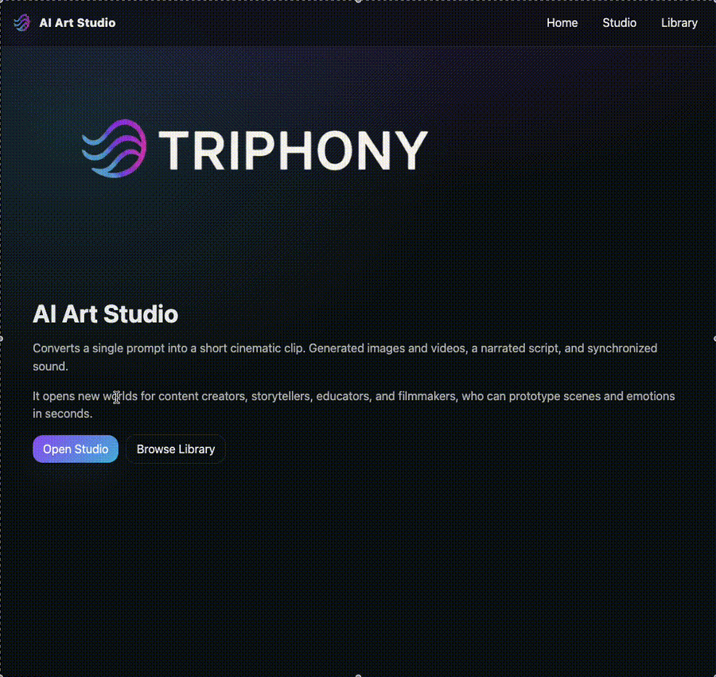
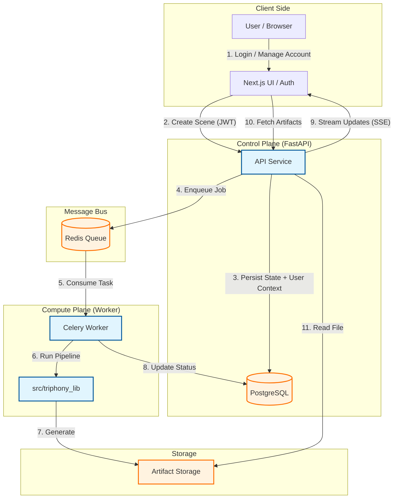

# Triphony AI Art Studio 🎬



**An Event-Driven Generative AI Platform** designed to orchestrate multi-modal asset generation (Video, Audio, Narrative) from a single conceptual prompt.

This project demonstrates a production-grade architecture for handling long-running inference tasks. It decouples the user interface from the generation pipeline using an asynchronous worker pattern, ensuring a responsive experience even when orchestrating complex generative models.

## Architectural Highlights

*   **Asynchronous Task Orchestration:** Utilizes **Celery** and **Redis** to manage heavy inference workloads off the main thread, allowing the system to scale worker nodes independently of the API layer.
*   **Real-Time State Synchronization:** Implements **Server-Sent Events (SSE)** to stream granular progress updates and state changes to the frontend immediately as workers complete tasks.
*   **Provider-Agnostic Design:** The worker layer is designed with an adapter pattern, allowing easy swapping between mock generators (for zero-cost development) and real production APIs (Hugging Face, OpenAI, Stability AI) via configuration.
*   **Immutable Asset Versioning:** Generative iterations are version-controlled, preserving history and preventing data loss during creative exploration.

## Architecture



## System Components

```text
apps/web/                 Next.js dashboard (React + TypeScript)
                          - Studio UI (Home / Studio / Library)
                          - SSE consumption for live progress updates
                          - Responsive playback (image/audio) + editor actions

services/api/             FastAPI service (Python)
                          - REST API for scenes/assets (create, fetch, regenerate)
                          - SSE event stream for pipeline status
                          - Artifact serving (returns signed/served URLs)

services/worker/          Celery worker (Python)
                          - Consumes jobs from Redis
                          - Runs generation pipeline (mock or real providers)
                          - Writes artifacts + updates DB status

src/shared/               Shared library (Python)
                          - Celery app definition + task contracts
                          - Shared types/config helpers used by API + worker


## Quick Start (Local Development)

This guide assumes a standard macOS/Linux environment with Docker installed.

### 1. Infrastructure Setup
Spin up the persistence layer (PostgreSQL) and message broker (Redis):
```bash
docker compose up -d
```

### 2. Backend Services
Initialize the Python environment and install dependencies:
```bash
python3 -m venv .venv
source .venv/bin/activate
pip install -r services/api/requirements.txt services/worker/requirements.txt
```

**Terminal 1: API Service**
```bash
export PYTHONPATH="$(pwd)/services/api/src:$(pwd)/services/worker/src:$(pwd)/src"
uvicorn api.main:app --reload --port 8000
```

**Terminal 2: Worker Node**
```bash
export PYTHONPATH="$(pwd)/services/api/src:$(pwd)/services/worker/src:$(pwd)/src"
celery -A worker.tasks worker --loglevel=INFO
```

### 3. Frontend Application
Launch the Next.js dashboard:
```bash
cd apps/web
npm install
npm run dev
```

**Access Points:**
*   **Dashboard:** [http://localhost:3000](http://localhost:3000)
*   **API Documentation:** [http://localhost:8000/docs](http://localhost:8000/docs)

## Configuration & Providers

The system supports a `PROVIDER_MODE` configuration in `.env`:

*   `mock`: (Default) Generates high-fidelity placeholder assets locally. Ideal for UI development and integration testing without API costs.
*   `real`: Integrates with external inference APIs (currently configured for Hugging Face Video Inference).

## License
All rights reserved.