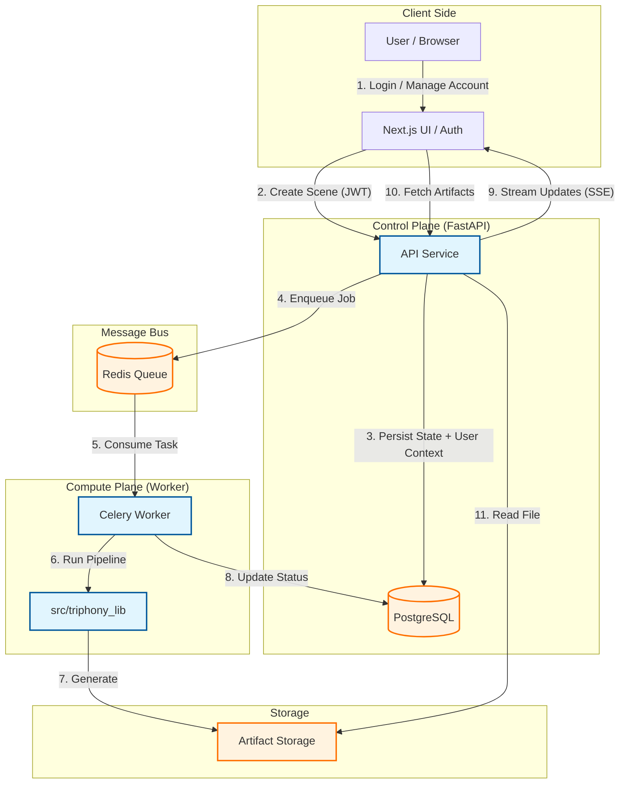
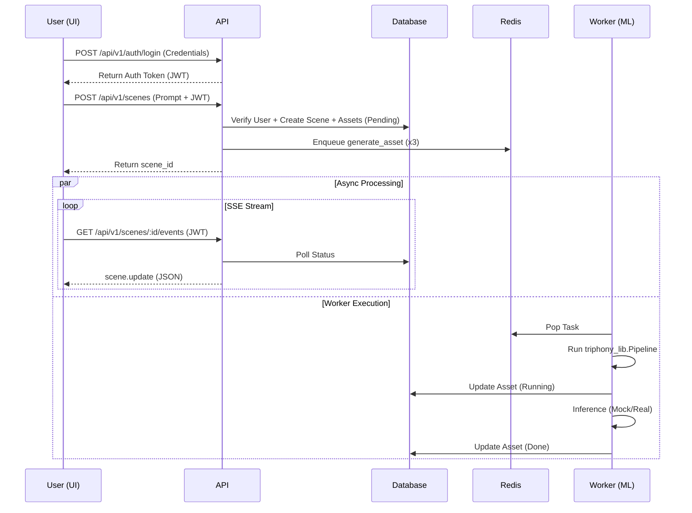

# Architecture (Portfolio Edition)

This repo is shaped like a real workflow product:

- **Next.js UI**: dashboard + editor UX (fast, responsive)
- **FastAPI API**: creates jobs, serves artifacts, streams status to the UI (SSE)
- **Celery worker**: runs long tasks (narrative/visual/soundtrack) without blocking HTTP
- **Postgres**: persistence (scenes + assets + versions)
- **Redis**: broker + results backend for Celery

## System Diagram

## Workflow Sequence

## Workflow

1) User authenticates via Next.js and receives a JWT token.
2) UI calls `POST /api/v1/scenes` with a prompt and JWT.
3) API verifies user, writes `Scene` + placeholder `Asset` rows.
4) API enqueues 3 worker tasks (fan-out).
5) Worker generates mock artifacts and updates DB.
6) UI subscribes to `GET /api/v1/scenes/{id}/events` (SSE polling) and refreshes cards.

Mock mode is the default so reviewers can run this with **zero keys**.
